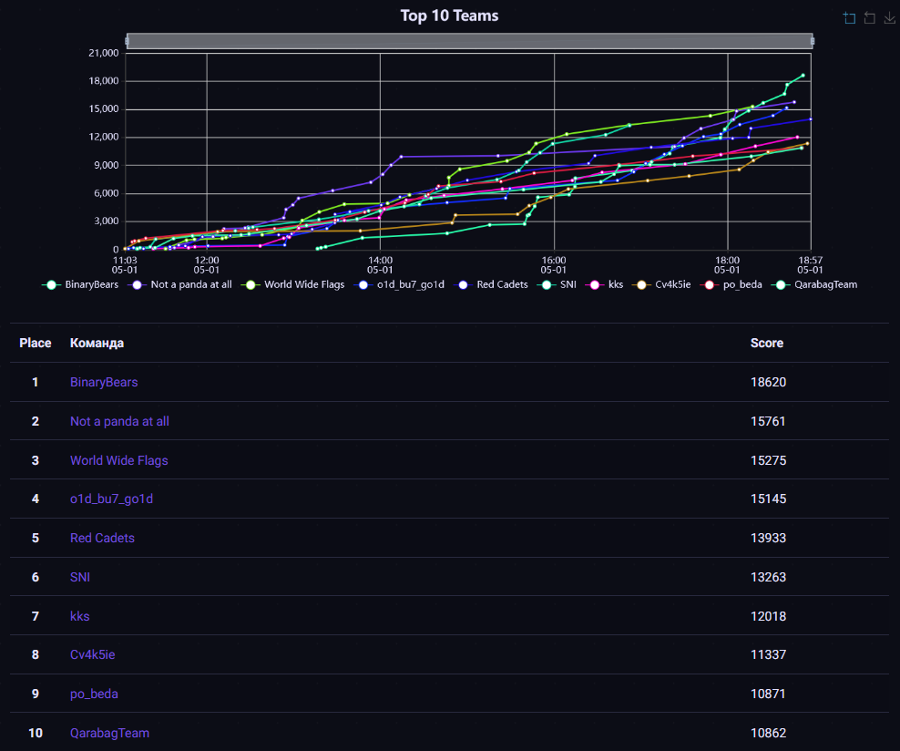

# MireaCTF Quals 2024
Исходные коды, разборы, сплоиты и файлы для деплоя заданий с отборочного тура MireaCTF, который проходил 1 мая 2024 года онлайн.

[Сайт соревнования](https://spring.mireactf.ru/)

- Организаторы: **РТУ МИРЭА** и **cR4.sh**
- Официальные партнеры: **Сбер**, **Angara Security**, **BIZONE**, **Лаборатория Касперского**

# Результаты

[Весь скорборд](scoreboard/full.png)

# Задания
| Название | Категория | Автор|
|------|-----------|-------|
| [access-denied](tasks/web/access-denied) | web | [@ezzh](https://t.me/NikitaBazilews) |
| [calculator](tasks/web/calculator) | web | [@ezzh](https://t.me/NikitaBazilews) |
| [crazypickles](tasks/web/crazypickles) | web | [@S4ar](https://t.me/XxX_S4ar_XxX) |
| [cryptopro](tasks/web/cryptopro) | web | [@cotsom](https://t.me/cotsom) |
| [cve-hunter](tasks/web/cve_hunter) | web | [@temlakoz](https://t.me/Nonsssse) |
| [path-to-library](tasks/web/path-to-library) | web | [@papuass](https://t.me/Chillov3k) |
| [cr1ng3-checker](tasks/rev/cr1ng3-checker) | rev | [@robert_sama](https://t.me/robert_sama) |
| [welcome](tasks/rev/welcome) | rev | [@avoidcode](https://t.me/avoidcode) |
| [necoarc-translator](tasks/rev/necoarc-translator) | rev | [@robert_sama](https://t.me/robert_sama) |
| [passbold](tasks/rev/passbold) | rev | [@avoidcode](https://t.me/avoidcode) |
| [evilcalc](tasks/rev/evilcalc) | rev | [@avoidcode](https://t.me/avoidcode) |
| [colorfee](tasks/misc/colorfee) | misc | [@temlakoz](https://t.me/Nonsssse) |
| [fishki](tasks/misc/fishki) | misc | [@ezzh](https://t.me/NikitaBazilews) |
| [lowlevel](tasks/misc/lowlevel) | misc | [@avoidcode](https://t.me/avoidcode) |
| [infernal-manager](tasks/osint/infernal-manager) | osint | [@LezhyX](https://t.me/LezhyX) |
| [isekai-to-nowhe](tasks/osint/isekai-to-nowhe) | osint | [@LezhyX](https://t.me/LezhyX) |
| [fun-in-the-waste](tasks/osint/fun-in-the-waste) | osint | [@LezhyX](https://t.me/LezhyX) |
| [stunning-biter](tasks/osint/stunning-biter) | osint | [@LezhyX](https://t.me/LezhyX) |
| [大阪の魔法少女](tasks/osint/ieroglif) | osint | [@LezhyX](https://t.me/LezhyX) |
| [cybercalc](tasks/ppc/cybercalc) | ppc | [@papuass](https://t.me/Chillov3k) |
| [slicky-tips](tasks/ppc/slicky-tips) | ppc | [@S4ar](https://t.me/XxX_S4ar_XxX) |
| [first-title](tasks/steg/first-title) | steg | [@papuass](https://t.me/Chillov3k) |
| [mrsecret](tasks/steg/mrsecret) | steg | [@ezzh](https://t.me/NikitaBazilews) |
| [soc-moment](tasks/forensic/soc-moment) | forensic | [@papuass](https://t.me/Chillov3k) |
| [optography](tasks/forensic/optography) | forensic | [@S4ar](https://t.me/XxX_S4ar_XxX) |
| [hello-name](tasks/pwn/hello-name) | pwn | [@robert_sama](https://t.me/robert_sama) |
| [ege](tasks/pwn/ege) | pwn | [@robert_sama](https://t.me/robert_sama) |
| [bingo-1337](tasks/pwn/bingo-1337) | pwn | [@robert_sama](https://t.me/robert_sama) |
| [nyaaashko](tasks/pwn/nyashko) | pwn | [@robert_sama](https://t.me/robert_sama) |
| [minirsa](tasks/crypto/minirsa) | crypto | [@ezzh](https://t.me/NikitaBazilews) |
| [larger-rsa](tasks/crypto/larger-rsa) | crypto | [@ezzh](https://t.me/NikitaBazilews) |
| [strongest-xor](tasks/crypto/strongest-xor) | crypto | [@ezzh](https://t.me/NikitaBazilews) |
| [data-deleted](tasks/crypto/data-deleted) | crypto | [@ezzh](https://t.me/NikitaBazilews) |

