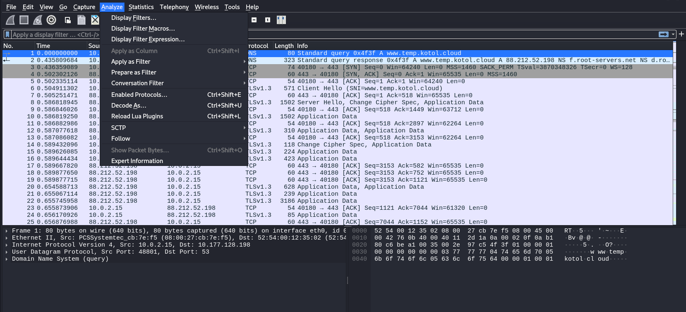
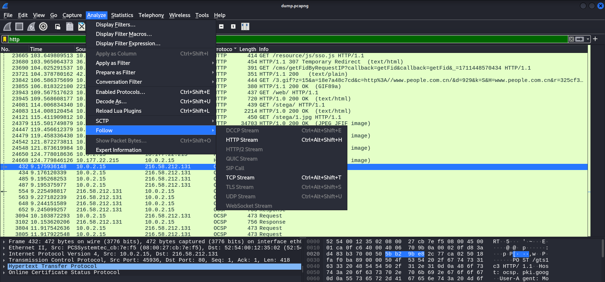
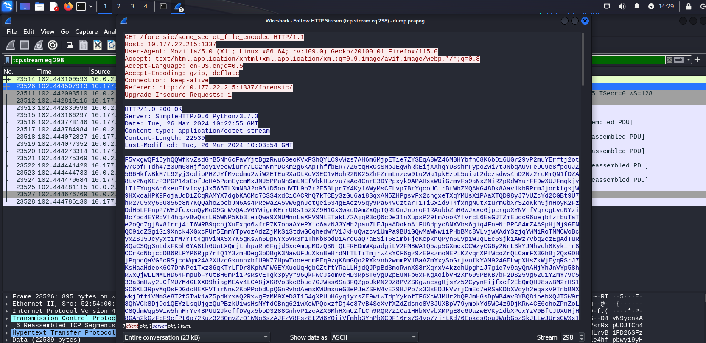
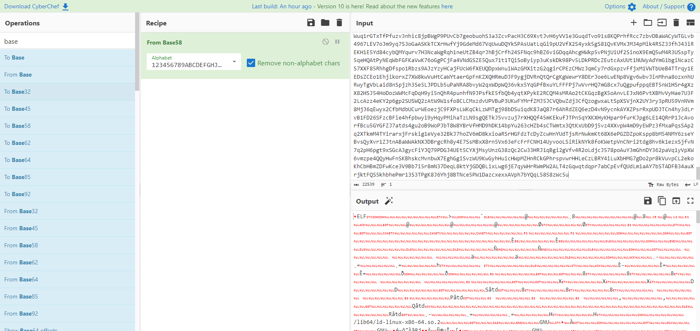
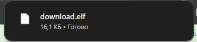
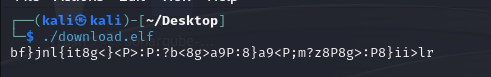
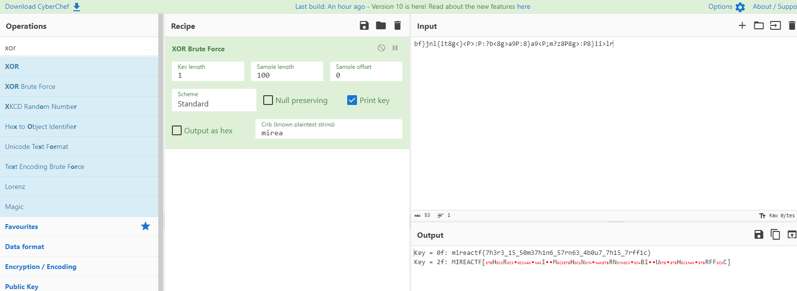

# Writeup SOC moment

Открываем дамп трафика в Wireshark. Можно долго листать дамп, смотреть, приглядываться, или просто тыкнуть Analyze -> Follow -> HTTP Stream





Если у вас не доступно выделение HTTP потока, то надо просто долистать трафик до момента, пока не будут происходить HTTP запросы, либо просто написать фильтр `http` как на скрине выше в зеленом поле.

В 298 потоке можно увидеть следующий запрос

```
GET /forensic/some_secret_file_encoded HTTP/1.1
Host: 10.177.22.215:1337
User-Agent: Mozilla/5.0 (X11; Linux x86_64; rv:109.0) Gecko/20100101 Firefox/115.0
Accept: text/html,application/xhtml+xml,application/xml;q=0.9,image/avif,image/webp,*/*;q=0.8
Accept-Language: en-US,en;q=0.5
Accept-Encoding: gzip, deflate
Connection: keep-alive
Referer: http://10.177.22.215:1337/forensic/
Upgrade-Insecure-Requests: 1
```

Ого! В дампе хотят получить какой-то секретный файл и в ответ на запрос что-то возвращают



Можем просто скопировать ответ и закинуть в CyberChef. Если попробовать раздекодить из base64, то ничего хорошего не выйдет. Вот так то. Потому что декодить надо из base58



В CyberChef можно удобно сохранить вывод. Сделаем это. 



Так как ELF это исполняемый файл Linux стоит попробовать запустить его на Linux. Логично.



Да это же почти флаг! Только с ним что-то не так. Он заксорен. Закинем в тот же CyberChef или dcode.fr



## flag

`mireactf{7h3r3_15_50m37h1n6_57rn63_4b0u7_7h15_7rff1c}`