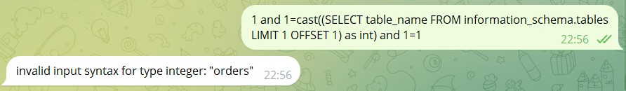

# SQL Injection

При запуске бота видим 3 его функции


Последние 2 кнопки не принимают какую-либо информацию, поэтому вряд ли получится что-то сделать с ботом с помощью них, пропускаем эту часть функционала


По самой первой кнопке как видим есть возможность выбора напитка, так же нам предлагают бесплатно попробовать цитрусовый раф


Тыкаем функционал, покупаем бесплатный кофе


Видим бесплатный промокод для 20% скидки на следующий заказ, но вспоминаем описание таска и понимаем что нам нужно вытащить самый выгодный купон который выдаётся за покупку самого дорого кофе, на что так же намекает картинка с флагом воткнутым в `Голубинный Оазис` из меню


При попытках купить другие позиции бот сообщает нам о том, что у нас недостаточно средств. Попробуем ввести в него непредсказуемые данные вместо номера позиции чтобы попытаться его сломать


Обнаруживаем ошибку column does not exist и идём её гуглить, натыкаемся на то что это ошибка PostgreSQL


А раз это ошибка от SQL, можно попытаться выполнить атаку - SQL Injection

Заходим например на самый популярный github репозитрий с полезными нагрузками (payloads)  и ищем их для PostgreSQL [тык](https://github.com/swisskyrepo/PayloadsAllTheThings/blob/master/SQL%20Injection/PostgreSQL%20Injection.md)


Учитывая что нам вернулась ошибка "column does not exist" и если SQL инъекция правда существует, то у нас как минимум один вектор атаки через SQL инъекции Error Based SQL Injection суть которой как раз возможность вытащить всю информацию из базы данных через SQL ошибки


Видим 2 способа атаки через Error Based


Сначала прикидываем примерную структуру SQL запроса которая скорее всего выполняется в боте при попытке что-то купить:

`SELECT ... from chto-to-tam WHERE id = НАШ_ВВОД;`

Теперь попытаемся прикинуть как внедрить payload под нашу примерную ситуацию

`SELECT ... from chto-to-tam WHERE id = 1,cAsT(chr(126)||vErSiOn()||chr(126)+aS+nUmeRiC) ;`

выглядит довольно странно, но попытаемся использовать всякими способами:


Ничего не помогает, попытаемся проэксплуатировать уязвимость вторым способом

`' and 1=cast((SELECT concat('DATABASE: ',current_database())) as int) and '1'='1`

Тут важно отметить, что SQL запрос можно строить по разному и под каждый способ payload будет отличаться

Например один и тот же запрос может выглядеть по-разному из-за обрамления:

`SELECT ... from chto-to-tam WHERE id = 'НАШ_ВВОД';`

`SELECT ... from chto-to-tam WHERE id = "НАШ_ВВОД";`

`SELECT ... from chto-to-tam WHERE id = НАШ_ВВОД;`

`SELECT ... from chto-to-tam WHERE id = ('НАШ_ВВОД');`

`SELECT ... from chto-to-tam WHERE id = ("НАШ_ВВОД");`

`SELECT ... from chto-to-tam WHERE id = (НАШ_ВВОД);`

Соотвественно payload из [PayloadsAllTheThings](https://github.com/swisskyrepo/PayloadsAllTheThings/blob/master/SQL%20Injection/PostgreSQL%20Injection.md) написан под самый распространенный случай - заключение пользовательского ввода в одинарные кавычки чтобы получилось что-то такое:


перед payload'ом добавил единичку чтобы запрос выглядел корректным и для наглядности красным цветом выделил то что вставляет пользователь, в конечном счёте формируется валидный SQL запрос, который вызывает нужную нам ошибку и выводит имя базы данных через функцию current_database()

Теперь попробуем узнать вид используемого обрамления, как мы уже предположили наш запрос примернт такой:

`SELECT ... from chto-to-tam WHERE id = 'НАШ_ВВОД';`

в случае с одинарными кавычками мы можем передать `1' and '1'='1337'` и должен получиться корректный запрос вида `SELECT ... from chto-to-tam WHERE id = '1' and '1'='1337';`

В случае если у нас одинарные кавычки нам должен вернуться ответ без ошибок с сообщением о том что такой позиции просто не нашлось из-за условия '1'='1337' которое всегда ложное

Видим что с одинарным обрамлением не угадали:


для " будет такой валидный запрос: 1" and "1"="1337"

для пустого обрамления будет например такой: 1 and 1=1337

и так далее


Учитывая что все варианты кроме пустого обрамления вернули ошибки, делаем вывод что обрамление пустое а SQL инъекция всё же существует.

Вернёмся к нашим payload'ам и подкорректируем их в соответствении с обрамлением и примерной структурой SQL запроса чтобы запрос всегда выходил валидным:

```
1 and 1=cast((SELECT concat('DATABASE: ',current_database())) as int) and 1=1
1 and 1=cast((SELECT table_name FROM information_schema.tables LIMIT 1 OFFSET data_offset) as int) and 1=1
1 and 1=cast((SELECT column_name FROM information_schema.columns WHERE table_name='data_table' LIMIT 1 OFFSET data_offset) as int) and 1=1
1 and 1=cast((SELECT data_column FROM data_table LIMIT 1 OFFSET data_offset) as int) and 1=1
```

Вытаскиваем имя БД (как доказательство наличия уязвимости, оно не пригодится):


Вытаскиваем имена таблиц:





примечание: data_offset это изменяемое число, что авторы payload'а не уточнили, но что и так понятно если разбираться в SQL

После того как мы получили название таблицы products которое скорее всего и содержит промокод - идём дампить его названия колонок


Судя по названию колонки purchase_text и с тем фактом что нам приходит промокод при покупке - делаем выводы что все промокоды лежат там и начинаем дампить


Получаем наш долгожданный флаг mireactf{blue_c0ff3e_only_f0r_blu3_bl00d} через последнюю команду

`1 and 1=cast((SELECT purchase_text FROM products LIMIT 1 OFFSET 3) as int) and 1=1`


## Alt solution
15  union select '-10000'
and buy need coffee