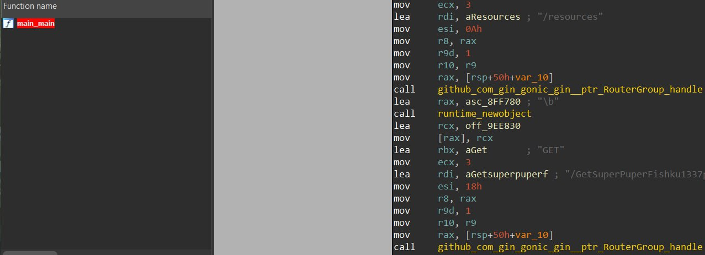

# misc | Fishki

## Information
Нашел нереальный сайт с большим количеством полезных фишек в cs2, зацени

## Writeup

Path traversal в filename=../../../../etc/passwd => видим fishki:x:2000:2000:Linux User,,,:/app:/bin/sh (домашняя директория пользователя fishki это /app)

Фаззим файлы и находим бинарь /app/app 

Реверсим golang и находим ручку /GetSuperPuperFishku1337 за которой и находится наш флаг mireactf{8c3143cf-e7fb-4958-9b07-96ea77e3dd47}

