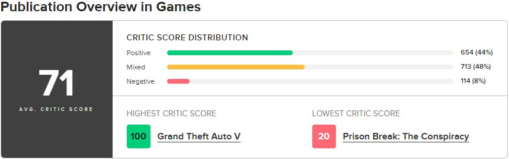
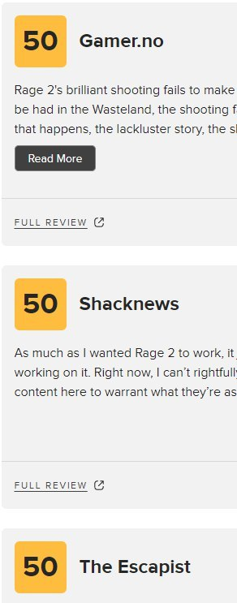
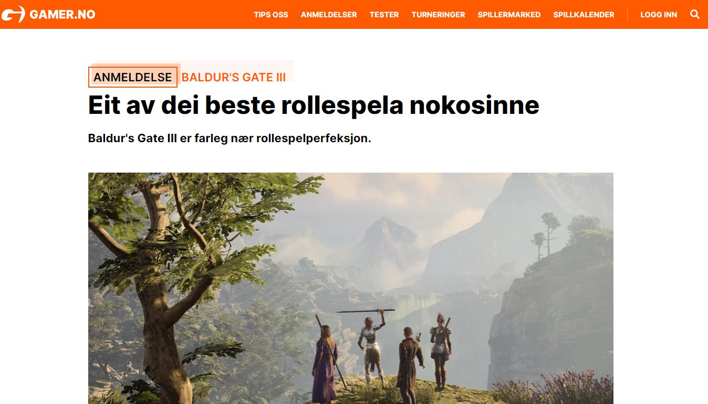
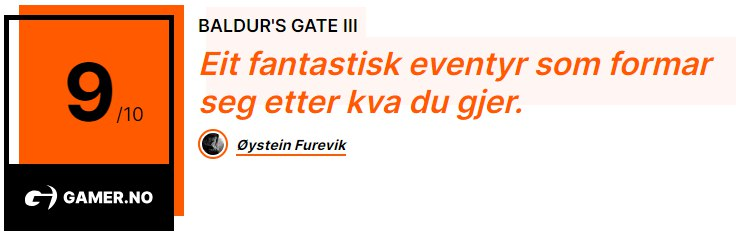

# osint | Fun in the Wasteland

## Information

Один из культовых программистов шутеров однажды нелицеприятно высказался о сюжете в играх. В последствии судьба отвернулась от него - его последний проект вышел не очень удачным, а сам программист в итоге ушел в область ИИ. Однако саму игру не забросили, а относительно недавно даже вышел сиквел, с неплохими оценками. Один иностранный сайт даже сравнил игру с более классическими представителями жанра, хоть и поставил на самом известном агрегаторе для рецензий самую низкую оценку из имеющихся для этой игры.

Надо найти этот сайт.

Флаг - заголовок рецензии от этого сайта для самой высокооцененной РПГ прошлого года и оценка этой РПГ. 
Пример - **mireactf{Cloud_roza_las_nubes_con_una_entrega_magistral_9.7/10}**

## Writeup
По описанию таска можно найти указанного культового программиста - Джона Кармака. Его последним проектом является Rage, сиквел которого вышел относительно недавно. 

Самым популярным сайтом для оценки видеоигр является Metacritic - смотрим там обзоры на игру и видим три рецензии с самой низкой для игры оценкой в 50. Смотрим их профили на сайте и видим, что картинка, приложенная к таску, соответствует профилю сайта Gamer.no. 

Переходим на этот сайт и ищем там рецензию на самую высокооцененную РПГ 2023 года (можно найти просто загуглив) - Baldur's Gate 3. 

Копируем заголовок рецензии, добавляем оценку сайта и получаем флаг

## Flag
`mireactf{Eit_av_dei_beste_rollespela_nokosinne_9/10}`