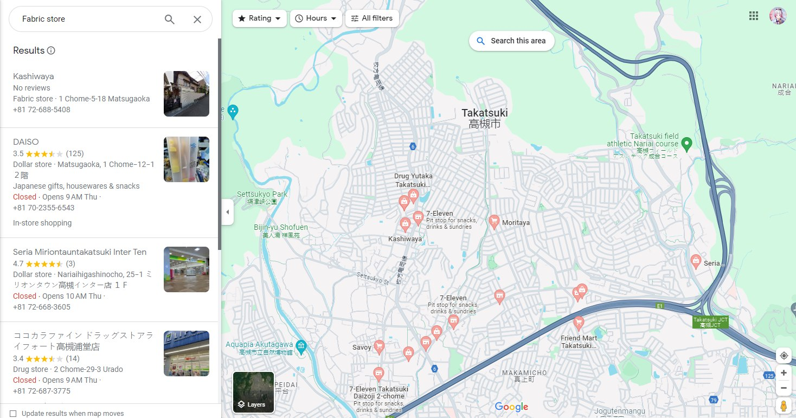
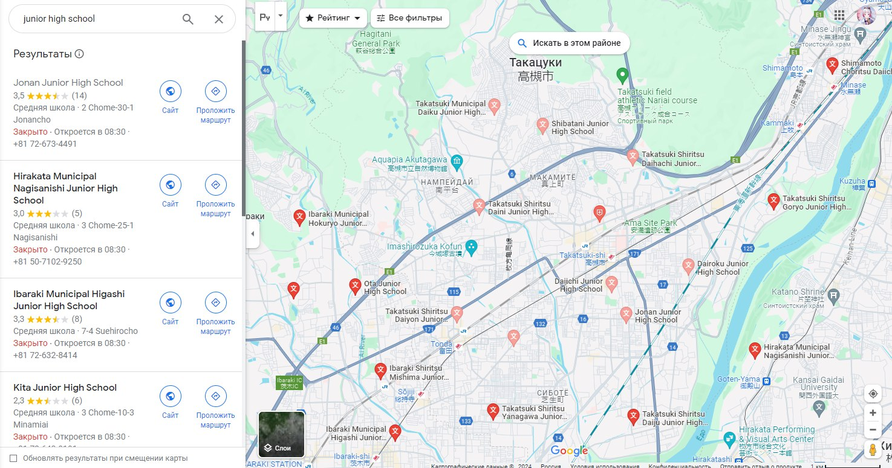
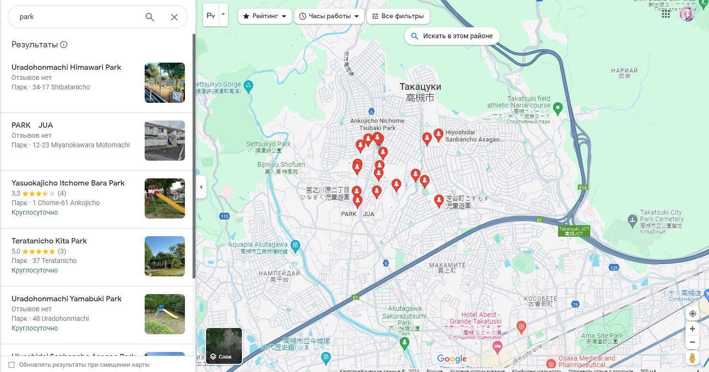
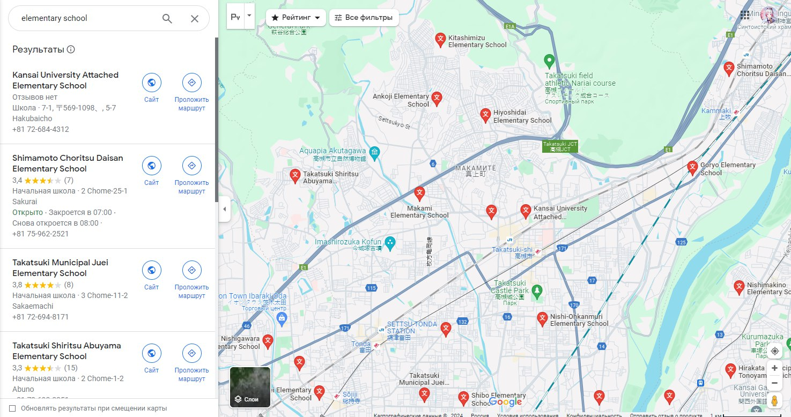
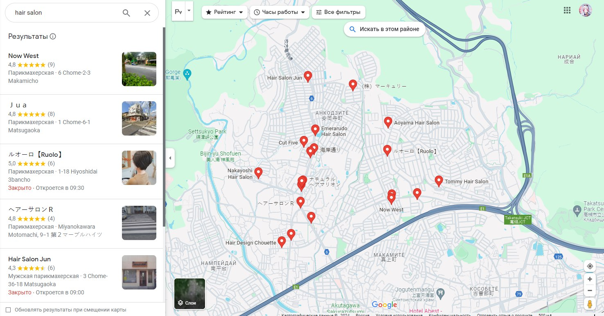
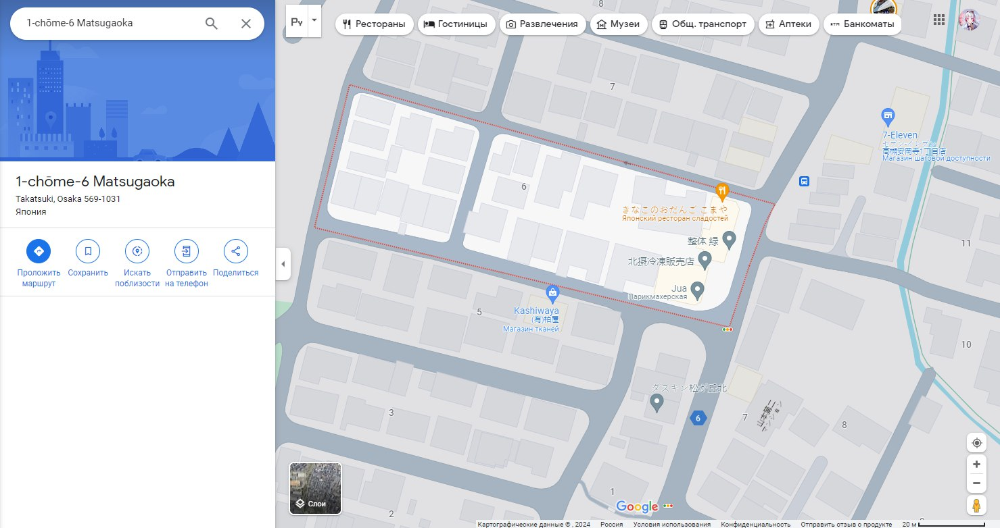

# osint | 大阪の魔法少女

## Information
Волшебным девочкам из Трес Магии уже совсем надоели проделки  Магии Байзер, и они решили пойти на крайние меры - вычислить где она живет и совершить личный визит. К сожалению, они понятия не имеют о том, где живет их соперница, единственная зацепка - она скорее всего ходит в среднюю школу так же, как и они. К большой удаче во время последней битвы злодейка обронила несколько страниц из своего дневника, так что теперь у них есть куда копать. Помоги им найти, где же живет их враг.

Формат флага: **mireactf{7-chōme-3_Shimoyamatedori}**, номер дома указывать не нужно

## Public
peak.docx

## Writeup
Просматриваем название, описание, и док, приложенный к таску, и получаем следующие ориентиры:
- Нужная префектура - Осака

- Нужный город - Такацуки 

- Дом расположен рядом со средней школой (Junior High school)

- К востоку от дома есть парк, также из него можно увидеть начальную школу (Elementary school)
- Через дорогу от дома есть магазин тканей

- В искомом блоке домов есть парикмахерская

Заходим на Гугл карты (Яндекс в данном случае не поможет) и по ориентирам вычисляем локацию - 1-chōme-6 Matsugaoka (так как сказано не указывать номер дома, указываем номер блока).

## Flag
`mireactf{1-chōme-6_Matsugaoka}`