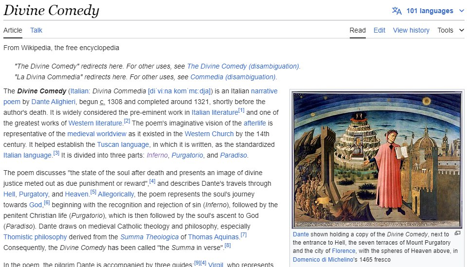

# osint | Infernal Manager

## Information
Увидел недавно читающую девушку и решил спросить что читает и на каком моменте. Она не ответила что за книга, начала нести всякую чушь про грехи, что находится на какой-то 15 песне первой части и что на главном герое книги основан герой еще какого то произведения, и в итоге скинула ссылку на трек на ютубе как подсказку - https://www.youtube.com/watch?v=XfTWgMgknpY

Ничего не понятно, но книга наверное интересная, помоги найти.

Флаг - название книги на английском и год начала ее написания.

Формат флага: **mireactf{Book_Name_YYYY}**

## Writeup

Из описания можно понять, что книга поделена на песни (является поэмой), и имеет тематику грехов, также герой книги взят за основу какого то другого героя. Ссылка на видео указывает на саундтрек к игре Limbus Company, так что заходим на вики игры и ищем главного героя. 

В игре их несколько, но основной, который также является менеджером (подсказка в названии таска) - Данте, который основан на герое поэмы Данте Альигери "Божественная комедия". 

Переходим на википедию и смотрим там название книги на английском и год начала написания и получаем флаг

## Flag
`mireactf{Divine_Comedy_1308}`