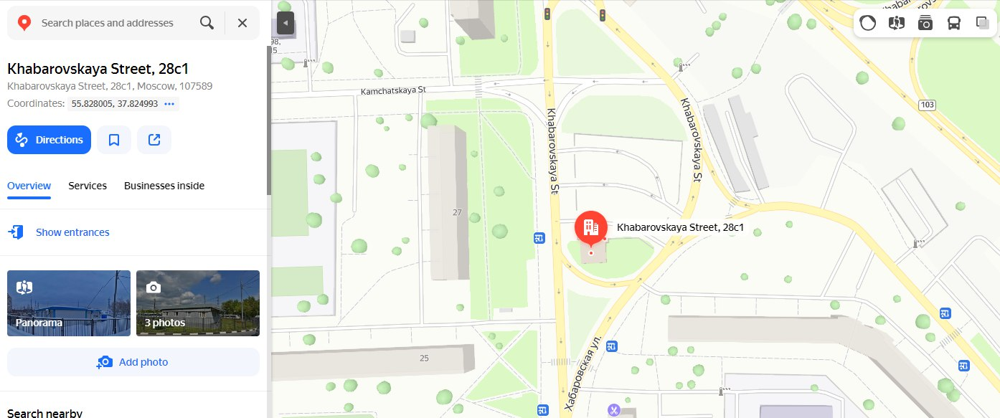

# osint | Isekai to Nowhere

## Information
Друг уснул в маршрутке под аcмрчик, а проснулся на конечной непонятно где. GPS у него не работает, а у прохожих этот стесняшка спрашивать не хочет, вот и обратился ко мне. 
К сожалению, у меня топографический кретинизм, поэтому мне нужна твоя помощь с нахождением здания с синей крышей.

Фомат флага: **mireactf{xx.xxx,yy.yyy}**

## Public
where.mp4

## Writeup
На видео можно заметить номер искомого здания - 28, и что он является стоянкой автобусов. Также в самом конце видео можно заметить номер проезжающего автобуса - 223, по его маршруту можно определить место съемки (в качестве дополнительной помощи могут также служить указатели) и адрес здания - Хабаровская улица, 28с1. 

Примерные координаты здания - 55.82800, 37.824993 в Яндекс картах и 55.827875,37.825325 в Гугл картах. В формате просят написать первые три цифры после запятой, поэтому урезаем координаты с округлением и получаем флаг

## Flag
`mireactf{55.828,37.825}`