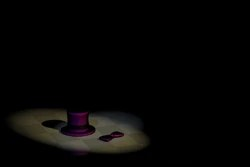
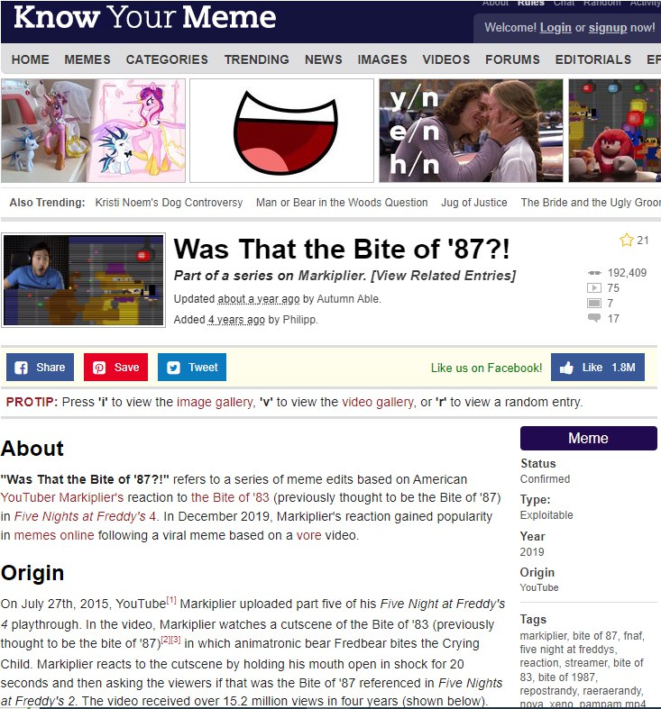
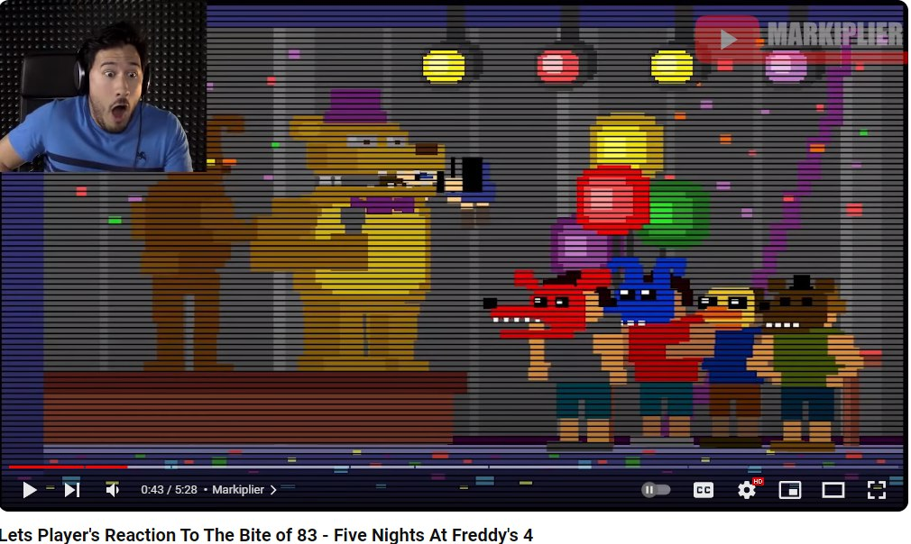

# osint | Stunning Biter

## Information

Эх, как же задолбало, что в последнее время блогеры для заманивания аудитории постоянно накручивают свои эмоции и ставят на превью свои скукоженные лица. А ведь помнится, что почти 10 лет назад один популярный блогер во время своего летсплея неиронично впал в шок с отрытым ртом от происходящих в игре событий на добрые пару десятков секунд. Только вот я что то подзабыл что за видео было...

Флаг - адрес ссылки на видео с таймкодом начала реакции.

Формат флага: **mireactf{https://www.youtube.com/watch?v=dQw4w9WgXcQ&t=42s}**

## Writeup
Из названия, описания и картинки получаем следующие зацепки:
- Картинка указывает на игру Five Nights at Freddy’s 4
- Ютубер во время записи видео по игре впал в шок с раскрытым ртом на пару десятков секунд 
- Все это как то связано с каким то укусом
Расчехляем гугл и ищем информацию по ключевым словам, например "fnaf 4 bite youtuber mouth open in shock". 

При правильном запросе одним из первых результатов будет ссылка на сайт Know Your Meme, описывающий ситуацию, полностью подходящую по нашим условиям.

Более сложный способ решения при невозможности составить нормальный запрос - поиск нужной реакции на упомянутый внутриигровой укус среди нарезок популярных ютуберов.

Находим нужное видео, оборачиваем ссылку в нужный формат с добавлением таймкода и получаем флаг

## Flag
`mireactf{https://www.youtube.com/watch?v=AZgnZSmbYn0&t=563s}` (можно было сдать +- пару секунд)