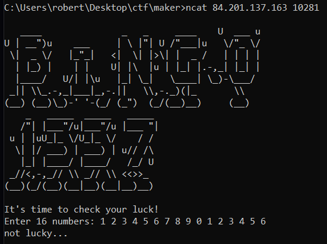
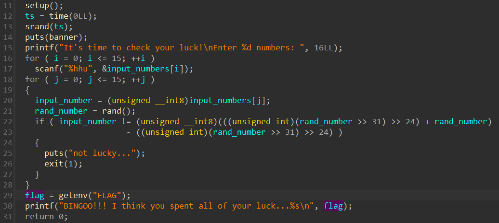

# pwn | бинго 1337

## Information
Нашел на просторах интернета крутую лотерею, уже выкачал на 77%

## Public
chall

## Writeup




Чтобы получить флаг, необходимо угадать 16 случайно сгенерированных чисел. Задача довольно тривиальна, так как в качестве сида генератора используется время запуска процесса ```time(0)```. 

Солвер можно найти в ```scripts/solver.py```.

## Flag
`mireactf{<dynamic>}`