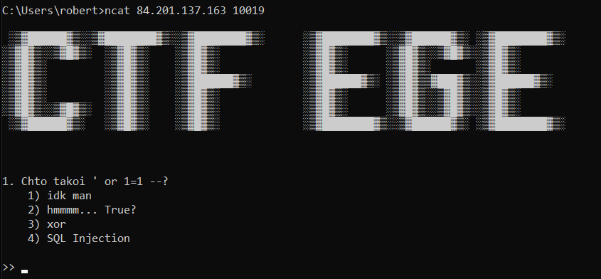
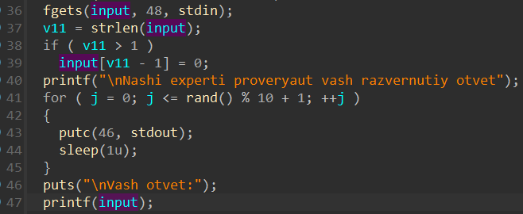

# pwn | ege

## Information
С постоянным ростом интереса к информационной безопасности и киберзащите, минобр решил внедрить новый Единый Государственный Экзамен (ЕГЭ) по кибербезопасности (CTF). Этот экзамен будет ориентирован на оценку навыков в области кибератак и защиты, включая умение обнаруживать уязвимости, эффективно реагировать на инциденты и разрабатывать стратегии защиты информационных систем.

В это году экзамен проходит в тестовом режиме, поэтому рекомендую сразу опробовать ;)

## Public
chall

## Writeup




Ключевым моментом в таске была передача пользовательского ввода в качестве первого параметра при вызове ```printf```, что позволило воспользоваться возможностями форматной строки. 


В самом начале функции ```main``` можно заметить копирование флага на стек, поэтому нам достаточно будет считать содержимое стека.

Солвер в ```scripts/solver.py```

## Flag
`mireactf{<dynamic>}`