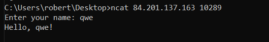
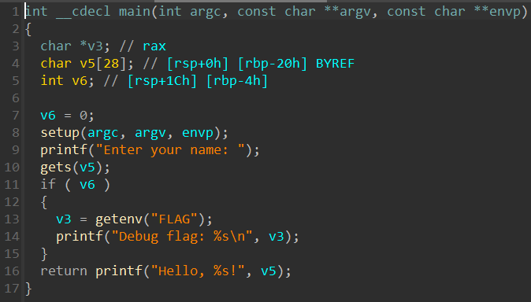
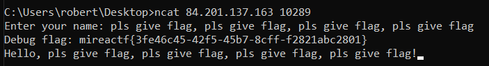

# pwn | hello, name

## Information
Написал свою первую программу на Си, не судите строго (◕‿◕✿)

## Public
chall

## Writeup




В самом начале листинга видно, что переменная ```v6``` зануляется, тем самым не позволяя нам получить флаг. К счастью вводимое имя запрашивается с помощью небезопасной функции ```gets```с передачей в него буфера```char v5[28]```, находящегося выше ```v6```. Так как ```gets``` считывает ввод до символа переноса каретки, мы спокойно можем выйти за границы нашего буфера и переписать значение переменной ```v6```. 

Таким образом, для решения было достаточно передать на вход ```pls give flag, pls give flag, pls give flag, pls give flag``` или любую другую строку длинно более 28 байтов.



## Flag
`mireactf{<dynamic>}`