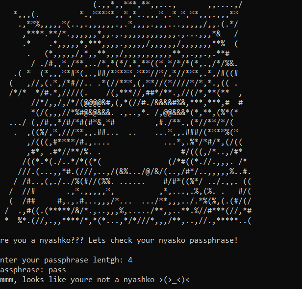
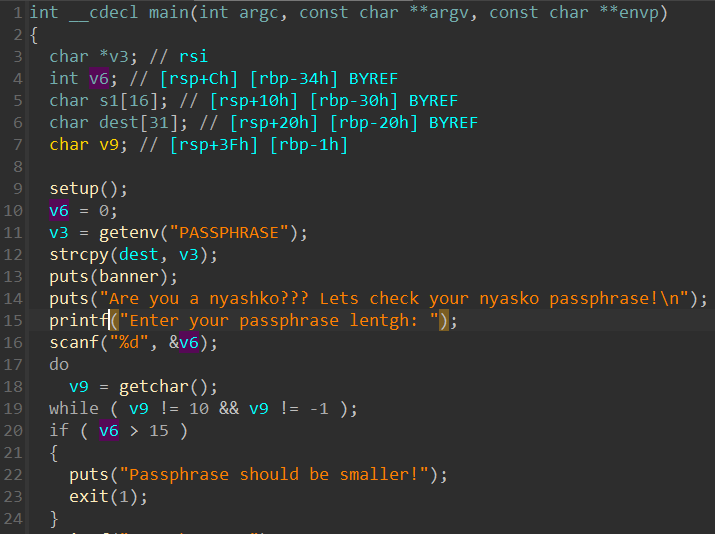

# pwn | няшкооо 

## Information
Что-то развелось в интернетах куча злюк, называющих себя няшками! Это подрывает основы сообщества няшек, в связи с чем было принято решение разработать специальное программное средство, позволяющее однозначно проверить няшность жителя сети интернет, а возможно это стало только потому, что все няшки знают няшный пароль ;)

Шах и мат, злюки!

## Public
chall

## Writeup




Внутри бинаря можно было найти функцию ```win```, в котрую, как ни странно, нужно было перенаправить поток управления. В данном случае единственный доступный способ для нас - переполнение буфера. Нам мешает предварительная проверка длинны вводимого сообщения, для обхода которой было достаточно использовать ```-1```, так как тип длинны сообщения - ```int```.

Солвер в ```scripts/solver.py```

## Flag
`mireactf{<dynamic>}`