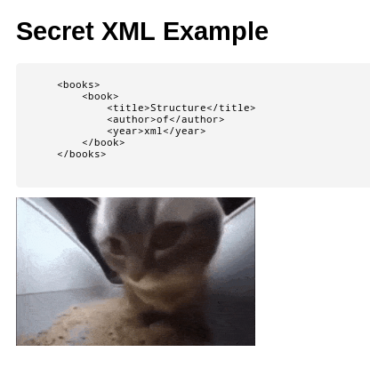
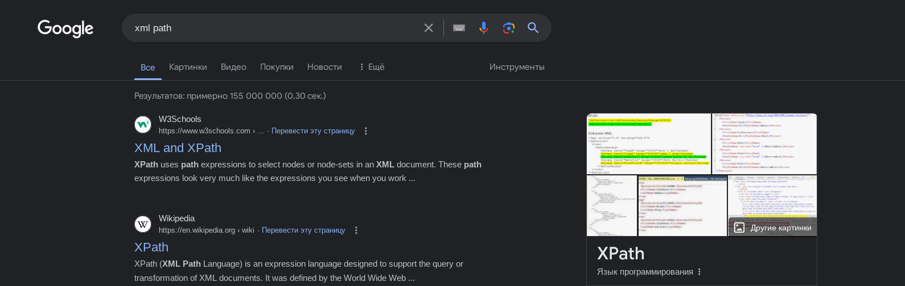

# Writeup PathToLibrary

Из описания таска **Пока что на нём всего лишь [ДАННЫЕ УДАЛЕНЫ] страницы** легко предположить, что на самом деле 
у нас больше чем двухстраничный сайт. Исользуя любой инструмент фаззинга (Burp Suite Intruder, ffuf, gobuster) можно быстро найти
страницу `/secret`



На ней мы видим некую xml структуру в формате которой хранятся книги.
Логично предположить, что 30 книг из топа как раз хранятся в таком формате и возможно, что есть 31 книга в которой и лежит флаг. Идем на страницу с поиском. Но как нам вытащить её из xml структуры? Ведь это не SQL, где могла бы быть инъекция. Если вы внимательно прочитали название таска, то заметили там слово Path. Получается, что у нас есть XML и какой-то path. 
Просто загуглив два этих слова находим такую вещь как XPath



Изучив, что это такое понимаем, что в таске мы должны проэксплуатировать XPath инъекцию. В этом нам может помочь https://book.hacktricks.xyz/pentesting-web/xpath-injection. Попробовав самый простой пэйлоад `//name` увидим сообщение


Наш запрос отклонен, т.к содержит недопустимые конструкции. Попробовав написать тоже самое с одним `/` ошибка пропадает. Суть ясна, теперь надо составить корректный пэйлоад

Пробуем на основе известной структуры из `/secret`...

`/books/book[contains(., 'mireactf')`

Ииии о нет :( Запрос опять отклонён


Догадываемся, что у нас есть некоторые фильтры. Найти их можно достаточно просто, попробовав все конструкции с hacktricks. Упрощая райтап сразу назову их: `contains()`, `//`, `not`

Составив пейлоад без этих конструкций и предполагая, что флаг разбит на части пробуем:

`/books/book[(substring(title, 1, string-length('mireactf')) = 'mireactf' or substring(title, string-length(title) - string-length('mireactf') + 1) = 'mireactf')`


Опять получаем ошибку, говорящую, что запрос некорректен. 

Видимо флаг стоит попробовать вывести целиком.

```
/books/book[(substring(title, 1, string-length('mireactf')) = 'mireactf' or substring(title, string-length(title) - string-length('mireactf') + 1) = 'mireactf') or 
            (substring(author, 1, string-length('{')) = '{' or substring(author, string-length(author) - string-length('{') + 1) = '{') or 
            (substring(year, 1, string-length('}')) = '}' or substring(year, string-length(year) - string-length('}') + 1) = '}')]
```


## flag
`mireactf{XP4th_1nj3ct10n_is_v3ry_f4n}`
